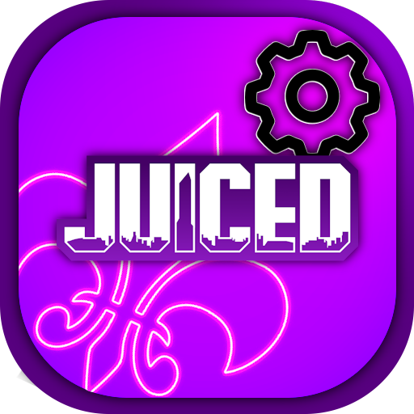
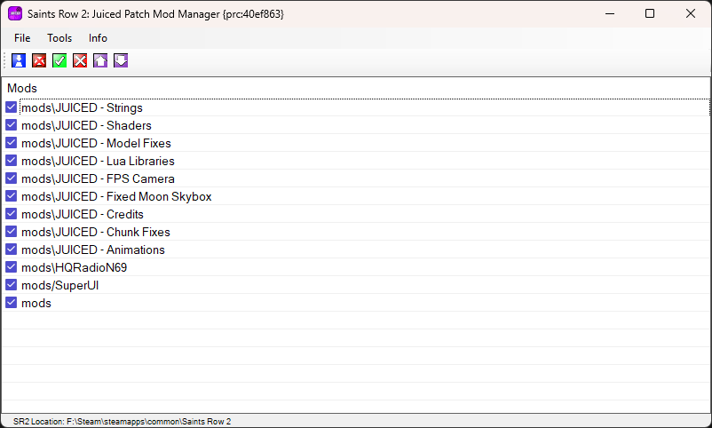
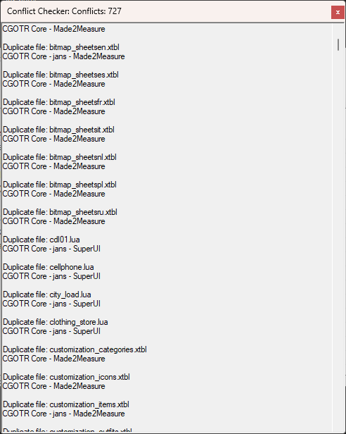

# SR2JP‑ModManager

A Mod Manager for *Saints Row 2 Juiced Patch*, making it easier to install mods, change load order, and uninstall mods.

---

# Features

- Very portable (Drag to desktop, run, link to your SR2 folder, and get managing!)
- Conflict Checker (Checks all your mods and compares with others, tells you what files conflict between mods)
- Auto-import mods directly from zip/7z/rar to your Juiced Patch mods folder in one single click
- Load order adjustments without touching loose.txt
- Enable/Disable mods directly from manager without deleting them.
- Delete mods directly from manager.

---

  
  
  

